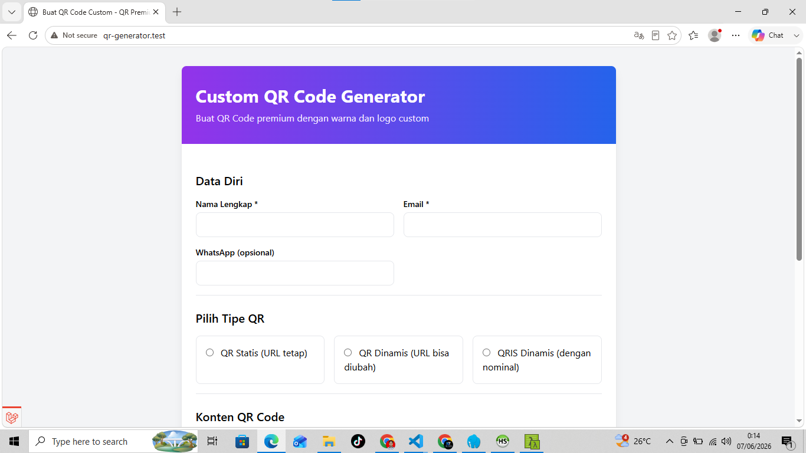

# SaaS QR Genarator

A sytem create QR Code premium with color and custom logo

## Features

### Core Features
- **select QR type** - Users create static QR codes and dynamic QR codes.
- **Payment Method** - Payment integrated with payment gateway (Midtrans).

## Screenshots

### Form Order


### Payment


## Tech Stack

- **Backend:** Laravel 13
- **Admin Panel:** Filament
- **Database:** MySQL
- **Frontend:** Tailwind CSS
- **Other:** Livewire, Alpine.js

## Requirements

- PHP >= 8.2
- Composer
- MySQL >= 5.7
- Node.js & NPM (for asset compilation)

## Installation

### 1. Clone the repository
```bash
git clone https://github.com/yourusername/barbershop-pos.git
<<<<<<< HEAD
cd barbershop-pos
=======
cd barbershop-pos
>>>>>>> 0a6d8f5 (Add project screenshots)
